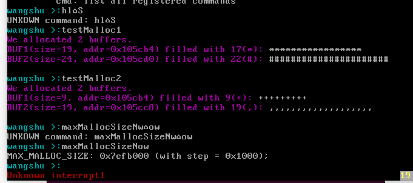

# Lab4 Memory Management 
**王舒 PB19071472**

### 软件框图

---
本次实验在之前的基础上，增加了对内存的分配和控制模块，由此就可以使用`malloc`函数接口，为用户分配内存了。
产生的变化主要在`kernel`中，增加了一些对内存的初始化、分配、回收、检测，可以直接操作硬件层面的实际的物理内存。同时，对`shell`也产生了一些改变，不必像之前一样把所有内容提前写在函数里，而是可以加入新的指令了。

### 主流程及其实现

本次实验的主流程和之前总体是一样的，但在`osStart`中增加了一些新的准备工作，调用`pMemInit()`函数来对内存的分配做初始化。（这个函数又调用了其他的一些东西，在下面进行说明）
进入`main`函数之后，启动经过修改的`shell`相关的函数以及一些测试程序。

### 主要功能模块及实现
- **内存检测和动态内存**
  流程图在上面的图里有说明。
  - 首先，在`osStart`中，调用`pMemInit()`函数，找到可分配内存的首地址。
  - 在该函数中，需要做两件事：检测可用内存的大小；找到可供自由分配的内存大小。
    - 检测内存：调用`memTest()`函数，从`1M`的位置出发，按照`1kB`为步长进行检测。
    - 删除`myOS`已经占用的部分：根据`myOS.ld`文件可以知道，这部分占用了从`1M`到`_end`所在的空间，因此需要判断是否调整内存地址开始的位置。
- **等大小分区管理算法**
主要的几个算法分别是初始化、分配和回收。

  - `eFPartitionInit()`：整个结构是一个链表，需要创建头上的`eFPartition`结构体和后面的一串`EEB`结构体。这里因为数目是已知的，可以全部建好。其中算地址的时候要考虑结构体本身的大小。
  ```cpp
    unsigned long eFPartitionInit(unsigned long start, unsigned long perSize, unsigned long n){
    struct eFPartition *efpHead=(struct eFPartition*)start;
    unsigned long real_persize = ((perSize + 3) >> 2) << 2;
    efpHead->totalN = n;
    efpHead->perSize = real_persize;
    efpHead->firstFree = start + sizeof(struct eFPartition);
    struct EEB *ptr;
    for (unsigned long i = 0; i < n; i++){
      ptr = (struct EEB *)(i * real_persize + efpHead->firstFree);
      ptr->next_start=(struct EEB *)((i+1)* real_persize + efpHead->firstFree);
    }
    ptr->next_start = 0;
    return start;
    }
  ```

  - `eFPartitionAlloc()`：直接把`firstFree`指向的地址拿过来就可以了，并调整链表结构
  - `eFPartitionFree()`；头插法把`mbstart`插入
- **动态分区管理算法**
主要的几个算法分别是初始化、分配和回收，由于是随取随用的，比等大小分区复杂一点，这里采用`first fit`策略。

  - `dPartitionInit()`：和等大小分区类似，建立一个头以及第一个`EMB`块，这个块在使用时会被逐渐分割。
  - `dPartitionAllocFirstFit()`：
    - 对于用户需要的空间大小，需要加上对它的管理块EMB，并对齐。
    - 采用`First Fit`算法，找到第一个合适大小的空闲块后，将它的前面一部分分割出来，并且把剩余部分串回链表里，并维护新的`EMB`块。但在分配的时候，需要给用户提供去掉`EMB`的地址。
  ``` cpp
    unsigned long dPartitionAllocFirstFit(unsigned long dp, unsigned long size){
      //下面处理block的大小
      //实际分配的block的大小和传入的参数size是不一样的
      unsigned long blockSize = size + sizeof(struct EMB);
      blockSize = ((blockSize + 3) >> 2) << 2; //四字节对齐
      //它最小值不是0，因为EMB数据结构有大小
      if(blockSize < sizeof(struct EMB)){
        blockSize = sizeof(struct EMB);
      }
      //先找first fit
      struct dPartition *dpHead=(struct dPartition *)dp;
      int find = 0;
      unsigned long pre=0, next=0;//作为遍历时记录方便合并
      unsigned long cur = dpHead->firstFreeStart;//正在访问的变量
      while (!find)
      {
        if(cur==0){//遍历到了最后一个结束，仍然没有找到
          find = 0;
          break;
        }
        if(((struct EMB*)cur)->size >= blockSize){//找到了合适的block
          find = 1;
          break;
        }
        pre = cur;
        cur = ((struct EMB *)cur)->nextStart;
      }
      if(find==0){
        return 0;
      }
      else{
        next = ((struct EMB *)cur)->nextStart;
        unsigned long size_remained;
        size_remained = ((struct EMB *)cur)->size - blockSize;
        //切割
        unsigned long new_cur = cur + blockSize;//切割后剩下部分的新head
        ((struct EMB *)new_cur)->size = size_remained;
        ((struct EMB *)cur)->size = blockSize;
        //前后连接
        ((struct EMB *)new_cur)->nextStart = next;
        if(pre!=0){
          ((struct EMB*)pre)->nextStart = new_cur;
        }
        else{
          dpHead->firstFreeStart = new_cur;
        }
      }
      return cur + sizeof(struct EMB);//返回用户可以使用的内存地址，在EMB块之后
    }
  ```

  - `dPartitionFreeFirstFit()`：
    - 释放内存时，由于我们在分配时去掉了`EMB`，这里需要把它再算回去。
    - 由于链表中的地址是按顺序由小到大排的，因此我们可以根据这一块空间的地址，找到可以嵌进去的位置。这里如果发现地址是连续的，要把两块合并起来，并更新`EMB`。
  ```cpp
    unsigned long dPartitionFreeFirstFit(unsigned long dp, unsigned long start){
    
      struct dPartition *dpHead = (struct dPartition *)dp;
      unsigned long real_start = start - sizeof(struct EMB);
      unsigned long end = real_start + ((struct EMB *)real_start)->size;
      //检查要释放的start~end这个范围是否在dp有效分配范围内
      if(real_start<(unsigned long )(dpHead+1)){
        return 0;
      }
      if(end > dp + dpHead->size){
        return 0;
      }
      //找到合适的位置插入链表，并合并（如果内存地址连续）
      struct EMB *cur=(struct EMB*)real_start,*pre = (struct EMB*)0, *next = (struct EMB *)dpHead->firstFreeStart;
      while(1){//找到对应的位置
        if((pre==0 && real_start<= (unsigned long)next) || next==0){
          break;
        }

        if(getEnd(pre)<=real_start && real_start<= (unsigned long)next){
          break;
        }

        pre = next;
        next = next->nextStart;
      }
      if(pre==0){//第一个
        dpHead->firstFreeStart = real_start;
        cur->nextStart = next;
        if(getEnd(cur)==(unsigned long)next){
          cur->nextStart = next->nextStart;
          cur->size += next->size;
        }
      }
      else if (next==0){//最后一个
        pre->nextStart = cur;
        cur->nextStart = 0;
        if(getEnd(pre)==(unsigned long)cur){
          pre->nextStart = 0;
          pre->size += cur->size;
        }
      }
      else{
        pre->nextStart = cur;
        cur->nextStart = next;
        if(getEnd(cur)==(unsigned long)next){
          cur->nextStart = next->nextStart;
          cur->size += next->size;
        }
        if(getEnd(pre)==(unsigned long)cur){
          pre->nextStart = cur->nextStart;
          pre->size += cur->size;
        }
      }
      return 1;
    }
  ```

- **shell的变化**
利用`malloc`函数，我们只需要将传入的东西写入新创建的结构体中，并把它添加到`ourCmds`链表里。

- **kmalloc和kfree接口**
用宏定义，可以利用之前写好的分配和回收函数做到这两个接口。（这种方式实现下，内核内存和用户内存没有隔离开）
```cpp
  #define kmalloc(size)   dPartitionAlloc(pMemHandler,size)
  #define kfree(start)	dPartitionFree(pMemHandler,start)
```

### 源代码说明
- 目录组织
  
- Makefile组织
  和之前一样，在各个文件夹下都有一个`Makefile`文件。
  `src`目录下的`Makefile`将各种其他子`Makefile`文件串联起来。在`output/myOS.elf`中，将`OS_OBJS`包含进去，而`OS_OBJS`将`MYOS_OBJS`和`USER_APP_OBJS`包含进去，`MYOS_OBJS`中又把目录下的`DEV_OBJS`、`I386_OBJS`、`PRINTK_OBJS`、`LIB_OBJS`、`KERNEL_OBJS`包含进去。这样就把所有需要编译成可执行文件的内容包含进去了。

### 代码布局说明（地址空间）
- OS部分
  这个`ld`文件将各可执行文件中的`text`、`data`和`bss`段分别拆开，然后拼接到一起。
	在`.text`段中，先把`multiboot_header`的启动头写进去，然后对齐，再把`text`部分写入。再对齐后，把`data`部分写入。再次对齐，把`bss`段写入，再经过一些对齐的处理。经过编译，就可以按照`ld`文件生成`elf`文件。
- 其他部分：供用户和内核使用的空闲空间

### 编译过程说明
`Src`目录下的`Makefile`将所有`.S`文件和`.c`文件按照`gcc`编译为可执行文件，然后按照`ld`文件的指示生成`elf`文件。（所有生成的可执行文件和`elf`文件都被放到了`output`文件夹中）。

### 运行和运行结果说明
分别输入测试用的命令和上回已经有的命令，运行结果如下




### 遇到的问题和解决方案说明
本次实验中，难点主要有这几方面
- 各种类型的互相转换，比如把正常的地址按照结构体来切割、转换，再在需要的时候转换回去。不过这也让我对指针的理解更深了Q_Q
- 各种对齐和位移的问题，比如在动态分区的时候，就要考虑有没有结构体本身的大小，还要对齐。这其实是一个比较繁琐和细节的东西，很容易出错
- 我的虚拟机以极高的频率死机，再也不想再看到watchdog_timeout这几个字了，最后用别人的电脑苟且搞定了lab