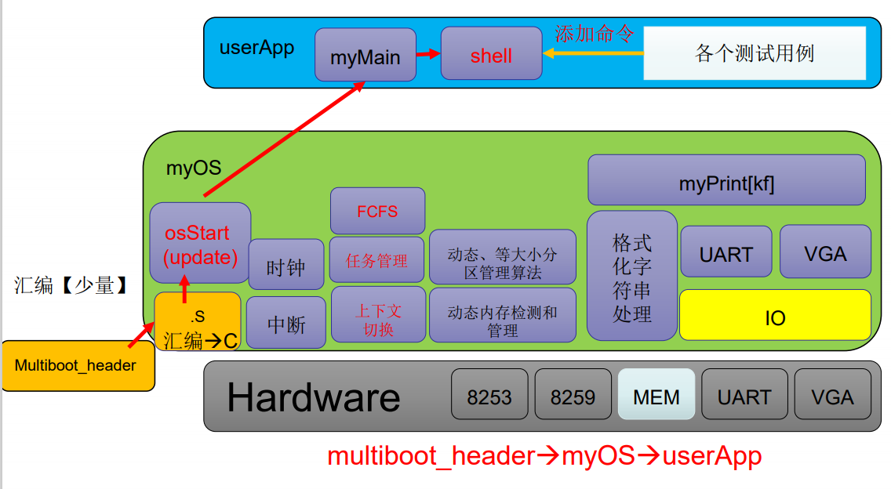
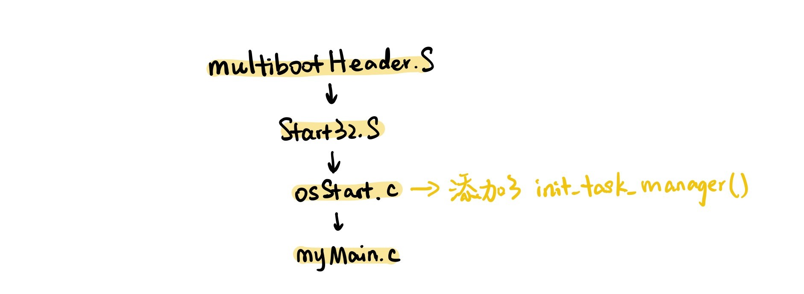
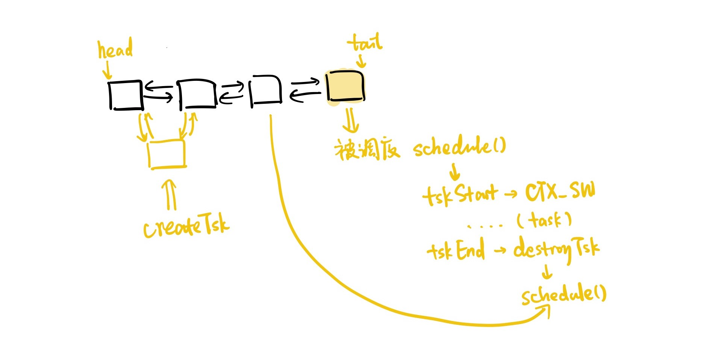
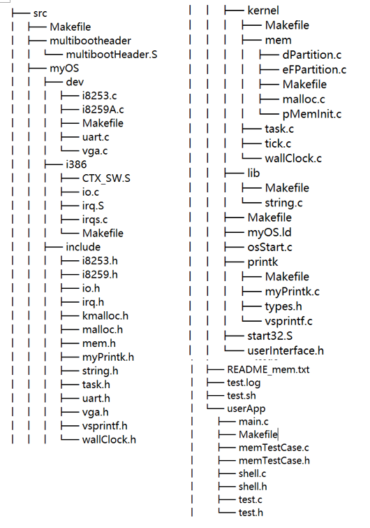

# Lab5 TaskManager & FCFS
**王舒 PB19071472** 

---
### 软件框图

本次实验主要添加了一个新的模块TaskManager，采用FCFS的调度策略。在osStart中对它进行初始化，然后在myMain中可以创建task，并把shell也作为一个task来运行。

---

### 主流程及其实现

本次实验的主流程和之前一样，但在osStart里添加了对task manager的初始化。之后，就可以把myMain、startShell作为任务添加到任务池中了。

---

### 主要功能模块及其实现
<font color="#dd0000">注：下面的部分函数接口以及实现和框架所给的有些微妙的区别，根据实际情况做了一些简化和修改</font><br />
流程图如下


- **任务的创建和销毁**
    - 任务管理块的结构
    包括了TCB声明时得到的栈空间的头地址、此task当前的栈顶地址(栈顶指针会随着若干次pop和push后会变化)、分配的pid以及作为链表节点用的next与pre两个指针。
    ```cpp
    struct myTCB {
        unsigned long *stkTop;//栈顶指针
        unsigned long *stack_head;//方便free
        int pid;
        int task_status;
        struct myTCB *next;
        struct myTCB *pre;
    };
    ```
    - 以及链表队列组成的任务池的结构（也是就绪队列，因为结构是重复的，而这个实验里面没有其他状态，这样写比较简单）
    ```cpp
     struct TCB_QUEUE{
     struct myTCB head,tail;
     int task_count;
     }fcfs_queue;
    ```
    - 创建 createTsk  
        - 首先初始化结构体中静态的部分
        - 调用init_stack，建立这个任务的栈（向下生长）
        - 把这个TCB丢进任务池中，即从队头入队
    ```cpp 
    int createTsk(void (*task)(void)){
        struct myTCB *new_TCB = (struct myTCB *)kmalloc(sizeof(new_TCB));
        new_TCB->pid = fcfs_queue.task_count++;
        myPrintk(0x2,"creat new task, pid=%d\n",new_TCB->pid);
        new_TCB->task_status = TASK_READY;

        new_TCB->stack_head = (unsigned long *)kmalloc(sizeof(unsigned long) * STACK_SIZE);
        new_TCB->stkTop = new_TCB->stack_head+(STACK_SIZE-1);
        init_stack(&(new_TCB->stkTop), task);

        new_TCB->next = fcfs_queue.head.next;
        new_TCB->pre = &fcfs_queue.head;
        fcfs_queue.head.next = new_TCB;
        new_TCB->next->pre = new_TCB;
        return new_TCB->pid;
    }
    ```
    - 销毁 destroyTsk  
      在任务池中根据pid找到该任务，然后利用kfree函数销毁释放其空间，并修改链表和计数器。
<br>

- **任务管理器的初始化**
  ```cpp
    void init_task_manager(){
    init_queue();
    createTsk(myMain);
    createTsk(idle_mainbody);
    startMultitask();
    }
  ```
  在这个部分，初始化动态任务池（也就是任务链表队列，对于FCFS来说），然后把myMain（实际上应该是initTskBody任务，但在本实验中他们是一样的）和Idle任务作为任务丢进任务池，并转入多任务状态执行。其中，在startMultitask()中，先用一个没有实际用处的全局变量来给CTX_SW用来牺牲掉的前一个栈空间。这样就完成了初始化，进入多任务运行。
  ```cpp
    unsigned long BspContextBase[STACK_SIZE];
    unsigned long *BspContext;
    //start multitasking;
    void startMultitask(void){
        myPrintk(0x2,"START Multitask......\n");
        BspContext = BspContextBase + STACK_SIZE - 1;
        currentTsk = nextFCFSTsk();
        do_CTX_SW(&BspContext,currentTsk->stkTop);
    }
  ```
    这里为了方便，用了一个do_CTX_SW函数，如下
    ```cpp
    //这两个全局变量被CTX_SW汇编代码直接读取使用，用来实际的传入参数
    unsigned long **prevTSK_StackPtr;
    unsigned long *nextTSK_StackPtr;

    void CTX_SW(void*prevTSK_STKPtr, void*nextTSK_STKPtr);

    //自动把传入的参数赋值给全局变量，用来和CTX_SW交换数据
    void do_CTX_SW(void*prevTSK_STKPtr, void*nextTSK_STKPtr){
        prevTSK_StackPtr = prevTSK_STKPtr;
        nextTSK_StackPtr = nextTSK_STKPtr;
        CTX_SW(prevTSK_StackPtr, nextTSK_StackPtr);
    }
    ```
<br/>

- **调度的历程简述**
  - 在初始化后，进入了IDLE状态，这是一个死循环，并不断调用schedule()函数。
  - 这里的schedule()函数采用FCFS策略，每次从队尾取一个任务并调用tskStart函数，再由它调用do_CTX_SW来切换上下文，进入该任务的处理。
  - 任务在结束时，会自己调用tskEnd函数，把控制权交回去（实际上这个地方直接用汇编也可以，任务自己调用这个函数还挺奇怪的）。tskEnd会调用destroyTsk删掉这个任务，然后调用schedule()，继续调度
  - 部分代码如下
  ```cpp
    void schedule(){
	myPrintk(0x2,"scheduling......\n");
    schedule_FCFS();
    }
    void schedule_FCFS(){
        struct myTCB *nextTSK = nextFCFSTsk();
        
        //这段代码是把调度出去的进程调到队首，防止其被连续再次运行
        nextTSK->next->pre = nextTSK->pre;
        nextTSK->pre->next = nextTSK->next;

        nextTSK->next = fcfs_queue.head.next;
        nextTSK->next->pre = nextTSK;
        fcfs_queue.head.next = nextTSK;
        nextTSK->pre = &fcfs_queue.head;
        
        tskStart(nextTSK);
    }
  ```

<br>

- **上下文切换**  
  主要针对于CTX_SW()进行解释
  - 核心数据结构myTCB里面包含了一个初始化完成的栈顶指针，这个栈里面已经push进了一些东西，把这个新的栈顶交给CTX_SW后，CTX_SW会完成如下工作：用栈里面的东西初始化通用寄存器，初始化esp，使用ret指令让cpu自动从栈顶再pop一个数出来作为继续运行的地址（这个栈的位置被我们设计为task目标的函数），于是就完成了切换上下文的步骤
  - 可以认为，下面的两句：
    ```
    movl prevTSK_StackPtr, %eax
	movl %esp, (%eax)
    ```
    把原来的栈顶指针保存在对应的位置（更新），而这一句：
    ```
    movl nextTSK_StackPtr, %esp
    ```
    加载新的栈顶指针
  - ret命令的运行方式  
  ret的实质是从栈中pop出来一个地址，写入到指令指针寄存器eip中，所以可以利用他来实现跳转，这样的优点在于只要给定栈顶寄存器的内容和栈顶指向的内存内容，就可以简单的让他跳转到给定的函数入口。
<br>

- **shell的变化**
在startShell末尾加上tskEnd，就可以将shell作为一个task。  
最终，myMain是这样的
```cpp
void myMain(void){    
    clear_screen();

    doSomeTestBefore();

	createTsk(myTsk0);
	createTsk(myTsk1);
	createTsk(myTsk2);

	initShell();
    memTestCaseInit();
    createTsk(startShell);

	tskEnd();
}
```

---

### 源代码说明
- 目录组织

- Makefile组织
  和之前一样，在各个文件夹下都有一个`Makefile`文件。
  `src`目录下的`Makefile`将各种其他子`Makefile`文件串联起来。在`output/myOS.elf`中，将`OS_OBJS`包含进去，而`OS_OBJS`将`MYOS_OBJS`和`USER_APP_OBJS`包含进去，`MYOS_OBJS`中又把目录下的`DEV_OBJS`、`I386_OBJS`、`PRINTK_OBJS`、`LIB_OBJS`、`KERNEL_OBJS`包含进去。这样就把所有需要编译成可执行文件的内容包含进去了。

---

### 代码布局说明（地址空间）
- OS部分
  这个`ld`文件将各可执行文件中的`text`、`data`和`bss`段分别拆开，然后拼接到一起。
	在`.text`段中，先把`multiboot_header`的启动头写进去，然后对齐，再把`text`部分写入。再对齐后，把`data`部分写入。再次对齐，把`bss`段写入，再经过一些对齐的处理。经过编译，就可以按照`ld`文件生成`elf`文件。
- 其他部分：供用户和内核使用的空闲空间，在本次实验中，我们用它们来分配各task的栈空间

---

### 编译过程说明
`Src`目录下的`Makefile`将所有`.S`文件和`.c`文件按照`gcc`编译为可执行文件，然后按照`ld`文件的指示生成`elf`文件。（所有生成的可执行文件和`elf`文件都被放到了`output`文件夹中）。

---

### 运行和运行结果说明
编译并运行的结果如下，各任务正常运行


---

### 遇到的问题和解决方案说明
- 汇编部分的理解很困难，需要查阅各寄存器的作用，最后理解透彻这个东西是怎么跑起来的，很微妙
- 感觉调度牵扯的东西乱七八糟云里雾里的，花了很长时间搞懂各个模块结构之间的内在关联，~~想清楚之后发现框架里有很多诡异的实现方法和好像没什么用的结构~~。为了方便写，就改了一部分，让逻辑更清晰一点
- 感觉实验的资料变少了，自我参透了很久，脑壳子很痛