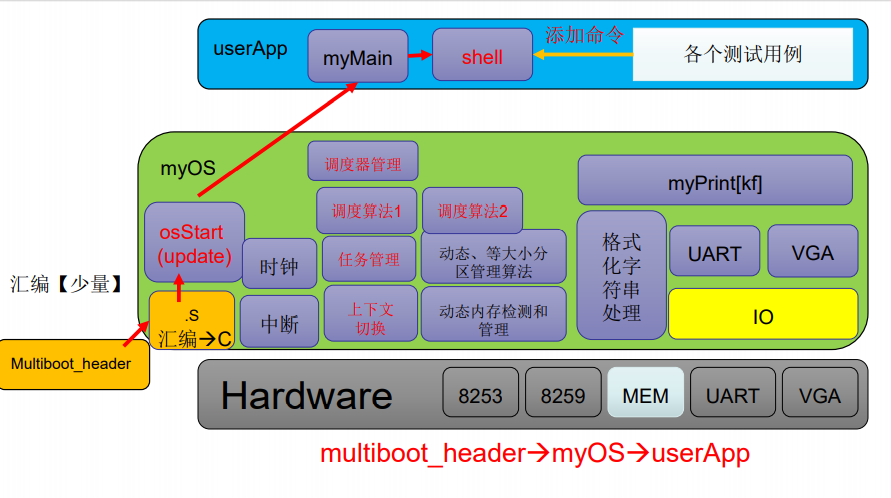
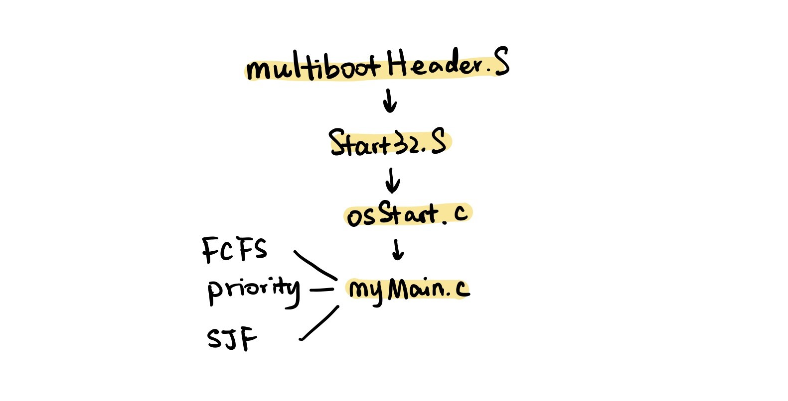
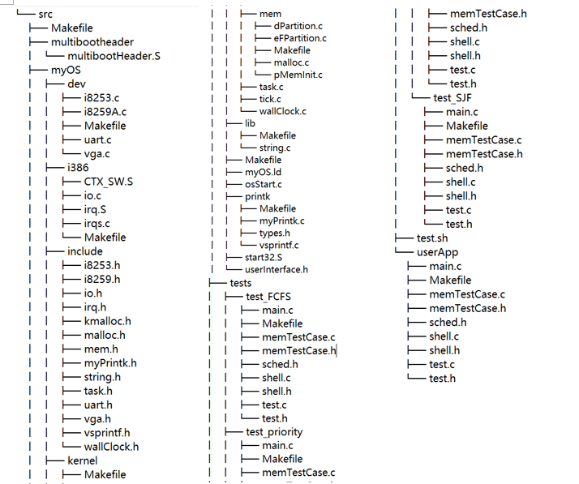

# Lab6 Scheduler
**PB19071472 王舒**

---

### 软件框图

本次实验添加了更多的调度算法，并通过钩子来调用不同的调度函数。用户态的测试程序也有了更多的选择，并通过修改脚本来自动执行这几个测试程序。

---

### 主流程及其实现

本次实验主要对调度的部分进行了一些添加和修改，除了`FCFS`外，还有`priority`和`SJF`算法。但主流程没有什么剧烈的变化。值得注意的是进入用户态后，会连续运行三个调度算法下的`myMain`。

---

### 主要功能模块及其实现
- **调度算法实现**
  基于任务池的链表队列实现，可以根据修改后的`myTCB`的新参数，实现`priority`和`SJF`算法。具体代码如下
  ```cpp
    void schedule_PRI(){
        struct myTCB *ptr = tcb_pool.head.next;
        struct myTCB *next_tsk;
        int max_pri = 0;
        while (ptr != &tcb_pool.tail){//优先级高的先调度
            if(ptr->pri>max_pri){
                max_pri = ptr->pri;
                next_tsk = ptr;
            }
            ptr = ptr->next;
        }
        tskStart(next_tsk);
    }

    void schedule_SJF(){
        struct myTCB *ptr = tcb_pool.head.next;
        struct myTCB *next_tsk;
        int min_time = 100000;
        while (ptr != &tcb_pool.tail)
        {
            if(ptr->time<min_time){
                min_time = ptr->time;
                next_tsk = ptr;
            }
            ptr = ptr->next;
        }
        tskStart(next_tsk);
    }
  ```
<br>

- **统一的调度相关接口**
  提供了调度器数据结构如下
  ```cpp
    struct scheduler{
        unsigned int type;
        void (*schedule)();
    }scheduler_FCFS,scheduler_PRI,scheduler_SJF;
  ```
  然后，利用钩子可以实现不同的调度方法。同时，在`init_task_manager`中也要对`Scheduler`进行初始化。
  （下面的`schedtype`在用户态程序中的`sched.h`中定义）
  ```cpp
    void (*schedule)();
    void getScheduler(){
        if(schedtype==SCHED_FCFS){
            schedule=scheduler_FCFS.schedule;
        }
        else if(schedtype==SCHED_PRI){
            schedule=scheduler_PRI.schedule;
        }
        else if(schedtype==SCHED_SJF){
            schedule=scheduler_SJF.schedule;
        }
    }
  ```
<br>

- **测试样例的说明以及脚本的修改**
  本次实验用三种调度来进行测试，位于`tests`文件夹内。其中，每种调度算法文件目录下的`sched.h`会修改对应的`schedtype`。  
  脚本文件修改如下，可以在这几个测试中自动切换。
  ```
    #!/bin/sh

    make clean
    echo "TEST FCFS"
    rm -rf userApp
    mkdir -p userApp
    cp tests/test_FCFS/* userApp/
    make
    if [ $? -ne 0 ]; then
        echo "make failed"
    else
        echo "make succeed"
        echo "START TEST FCFS"
        qemu-system-i386 -kernel output/myOS.elf -serial pty 
        read -s -n1 -p "按任意键以继续"
    fi
  
    make clean
    echo "TEST priority"
    rm -rf userApp
    mkdir -p userApp
    cp tests/test_priority/* userApp/
    make
    if [ $? -ne 0 ]; then
        echo "make failed"
    else
        echo "make succeed"
        echo "START TEST priority"
        qemu-system-i386 -kernel output/myOS.elf -serial pty 
        read -s -n1 -p "按任意键以继续"
    fi
  
    make clean
    echo "TEST SJF"
    rm -rf userApp
    mkdir -p userApp
    cp tests/test_SJF/* userApp/
    make
    if [ $? -ne 0 ]; then
        echo "make failed"
    else
        echo "make succeed"
        echo "START TEST SJF"
        qemu-system-i386 -kernel output/myOS.elf -serial pty 
    fi
  ```

  ### 源代码说明
- 目录组织

- Makefile组织
  在各个文件夹下都有一个`Makefile`文件。
  `src`目录下的`Makefile`将各种其他子`Makefile`文件串联起来。在`output/myOS.elf`中，将`OS_OBJS`包含进去，而`OS_OBJS`将`MYOS_OBJS`和`USER_APP_OBJS`包含进去，`MYOS_OBJS`中又把目录下的`DEV_OBJS`、`I386_OBJS`、`PRINTK_OBJS`、`LIB_OBJS`、`KERNEL_OBJS`包含进去。这样就把所有需要编译成可执行文件的内容包含进去了。
  值得注意的是，这里的`USER_APP_OBJS`在切换调度算法后是不一样的。

---

### 代码布局说明（地址空间）
- OS部分
  这个`ld`文件将各可执行文件中的`text`、`data`和`bss`段分别拆开，然后拼接到一起。
	在`.text`段中，先把`multiboot_header`的启动头写进去，然后对齐，再把`text`部分写入。再对齐后，把`data`部分写入。再次对齐，把`bss`段写入，再经过一些对齐的处理。经过编译，就可以按照`ld`文件生成`elf`文件。
- 其他部分：供用户和内核使用的空闲空间，在本次实验中，我们用它们来分配各task的栈空间

---

### 编译过程说明
`Src`目录下的`Makefile`将所有`.S`文件和`.c`文件按照`gcc`编译为可执行文件，然后按照`ld`文件的指示生成`elf`文件。（所有生成的可执行文件和`elf`文件都被放到了`output`文件夹中）。

---

### 运行和运行结果说明
编译并运行的结果如下，各任务正常运行


---

### 遇到的问题和解决方案说明
主要的算法实现起来不是很难，但是奇怪的数据结构好多不知道到底应该怎么实现，有点摸不清头脑，不过还是勉强实现出来了。最后这次实验主要是时间比较紧张，而且是基于自己写的lab5，感觉不是非常靠谱。  